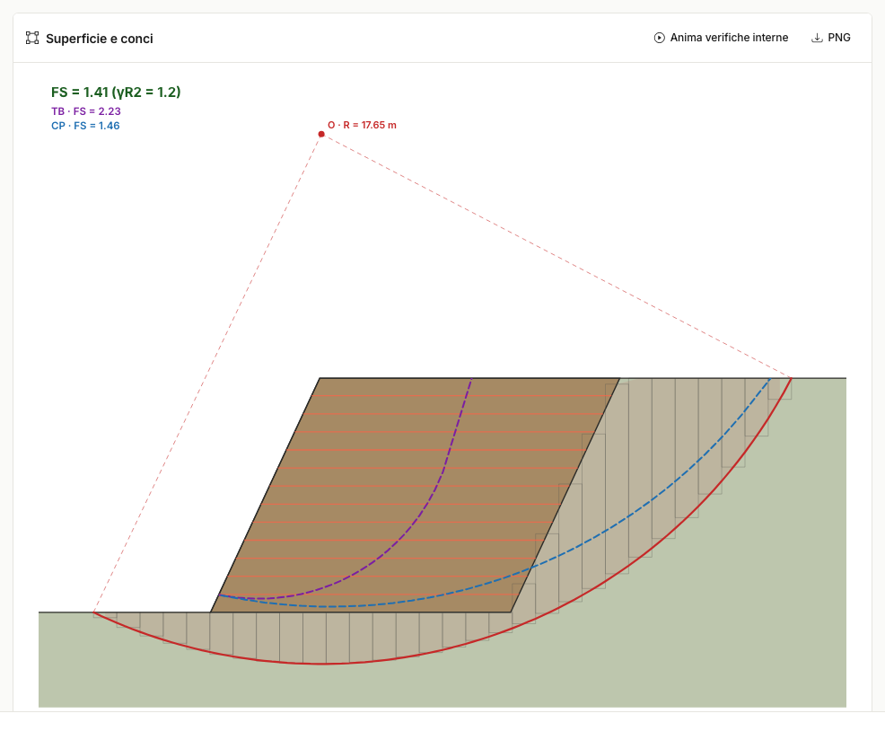
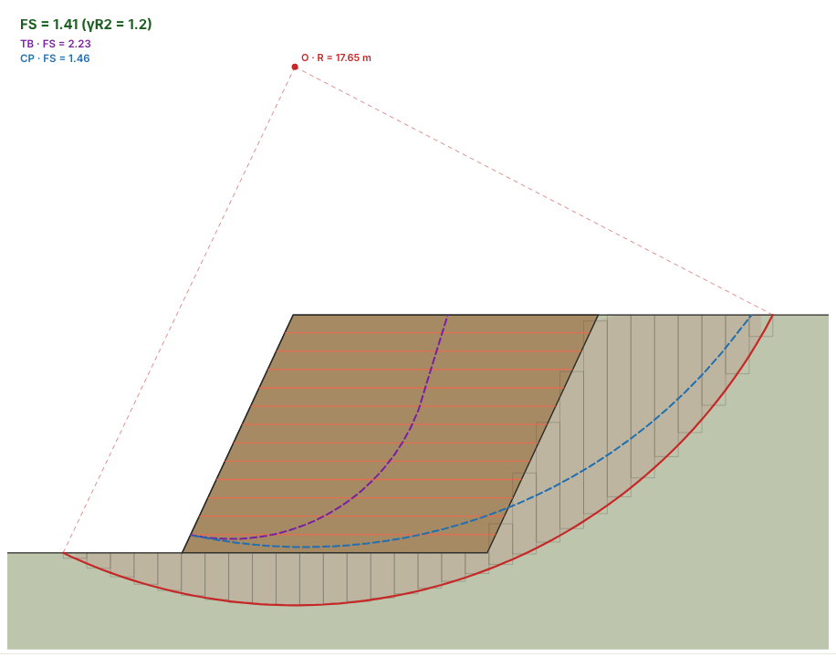

# Stabilità globale, tieback e compound

## Stabilità globale (Bishop)

Verifica con **Bishop semplificato** su superficie circolare, approccio **A2+M2+R2**:
parametri ridotti (γ~tanφ′~ = γ~c′~ = 1,25) e soglia **FS ≥ γ~R2~** (1,1 statica ·
1,2 sismica). Il cerchio è automatico (passa sotto l'opera) o vincolabile con i tre
punti valle/monte/base; i rinforzi che attraversano la superficie contribuiscono con
il minore fra R~d~ e lo sfilamento del tratto ancorato oltre il cerchio.

## Verifiche interne: tieback e compound

Quando il paramento è inclinato l'opera si comporta da terra rinforzata: oltre alla
globale, il programma analizza un **ventaglio di cerchi con uscita sul paramento** in
corrispondenza dei livelli di rinforzo:

- **Tieback** — superficie interamente nel volume rinforzato (ingresso sul coronamento);
- **Compound** — uscita sul paramento ma ingresso oltre il blocco (taglia anche il
  terreno spingente).

Per ciascuna famiglia viene riportato il **FS minimo** con il confronto γ~R2~, i
rinforzi attraversati e il cerchio critico, disegnato tratteggiato (viola il tieback,
blu il compound). Il pulsante **Anima verifiche interne** rigioca il ventaglio dei
cerchi provati; premilo di nuovo per tornare al disegno statico.

!!! tip
    Con paramento a 90° l'opera si comporta da muro e governano tipicamente le
    verifiche esterne; riducendo α (85° e meno) diventano significative le interne.

---

*Hai trovato un errore in questa pagina? [Segnalacelo](mailto:info@geostru.ai?subject=Help%20MRE%20NX) o apri una [Pull Request](https://github.com/EngSoft-Geostru/geostru-help-nx/edit/main/mre/docs/it/stabilita.md).*
