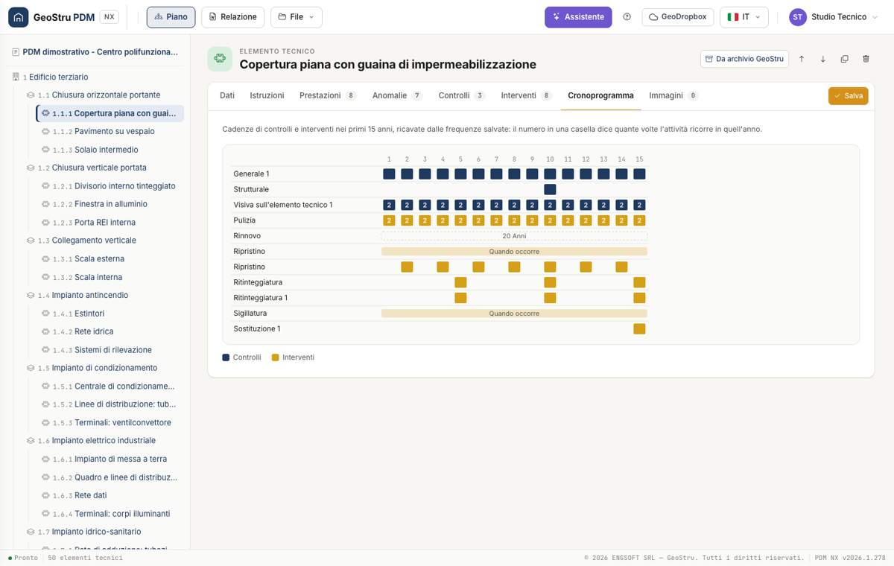

# Cronoprogramma

La scheda Cronoprogramma mostra controlli e interventi dell'elemento nei primi **15 anni** di esercizio. Le righe vengono ricavate dalle frequenze del piano; il grafico non sostituisce una revisione delle cadenze.

## Leggere le caselle

- Blu: controlli.
- Ocra: interventi.
- Numero: quante volte l'attività ricorre in quell'anno.
- **99+**: oltre 99 ricorrenze nell'anno.
- **Quando occorre**: attività senza periodicità calendarizzata.
- **Frequenza non specificata**: dato da rivedere.
- Una cadenza oltre i 15 anni viene riportata come testo.

L'orizzonte è annuale: non indica un mese o una data di scadenza concreta. Le attività giornaliere o frequenti vengono aggregate nel conteggio annuo.

## Nella relazione

Abilita Cronoprogramma nella pagina Relazione. Il Word contiene una tabella per ogni elemento con controlli o interventi, dopo i sottoprogrammi. I colori distinguono le due famiglie anche nella stampa.

---

*Hai trovato un errore? [Segnalacelo](mailto:info@geostru.ai?subject=Help%20PDM%20NX) o [proponi una correzione](https://github.com/EngSoft-Geostru/geostru-help-nx/edit/main/pdm/docs/it/cronoprogramma.md).*
