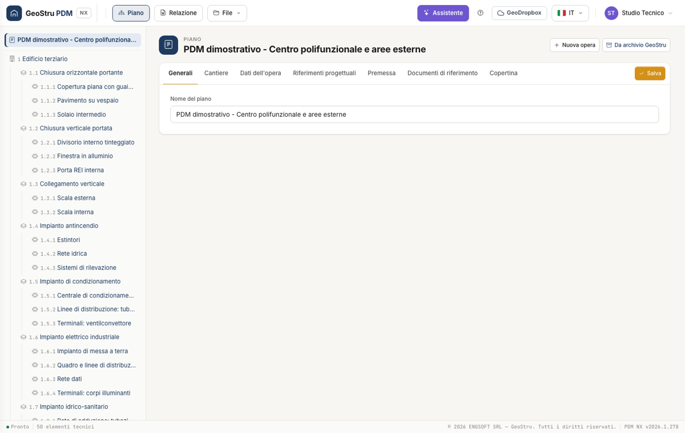

# PDM NX — Piano di manutenzione

PDM NX ti permette di redigere nel browser il piano di manutenzione dell'opera e delle sue parti. Organizza le opere, le unità tecnologiche e gli elementi tecnici; definisci prestazioni, anomalie, controlli e interventi; genera una relazione Word modificabile.

[**Apri PDM NX**](https://nx.geostru.ai/pdm/){ .md-button .md-button--primary }
[Guida rapida](quickstart.md){ .md-button }

## Cosa puoi preparare

- Manuale d'uso con descrizione, collocazione, immagini e uso corretto dei componenti.
- Manuale di manutenzione con livelli prestazionali, anomalie e manutenzioni.
- Programma di manutenzione con i sottoprogrammi di prestazioni, controlli e interventi.
- Cronoprogramma dei controlli e degli interventi nei primi 15 anni.
- Copertine personalizzate con studio, sottotitolo e logo.

Le schede dell'archivio GeoStru sono un punto di partenza modificabile. Devi adattarle ai materiali, agli impianti e alle condizioni dell'opera.

## Accesso e crediti

Accedi con il tuo account GeoStru NX. La composizione del piano e il salvataggio del file locale non consumano crediti. La generazione della relazione e i messaggi all'assistente AI sono operazioni a crediti: controlla la tariffa mostrata dalla piattaforma prima di usarle.

L'interfaccia è disponibile in sette lingue; le schede dell'archivio e la relazione sono in italiano.

## Riferimenti e revisione

La struttura del documento segue il piano di manutenzione previsto dalle NTC 2018, § 10.1, dalla Circolare n. 7/2019, § C10.1, e dall'art. 27 dell'Allegato I.7 al D.Lgs. 36/2023. Gli avvisi di completezza aiutano a individuare dati mancanti; la revisione e la responsabilità del piano restano al professionista.

[Consulta l'esempio complesso](esempio-complesso.md) oppure vai al [flusso di lavoro](workflow.md).

---

*Hai trovato un errore? [Segnalacelo](mailto:info@geostru.ai?subject=Help%20PDM%20NX) o [proponi una correzione](https://github.com/EngSoft-Geostru/geostru-help-nx/edit/main/pdm/docs/it/index.md).*
