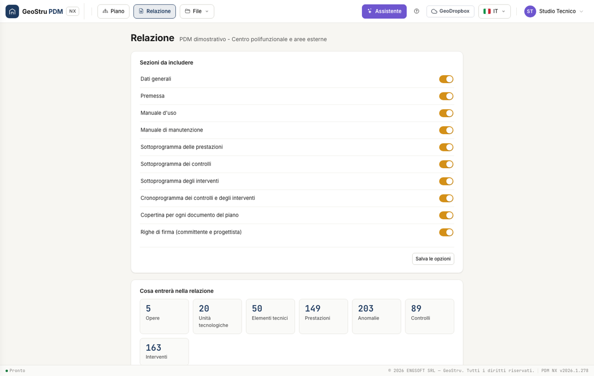

# Guida rapida: il primo piano

## 1. Compila i dati generali

Apri PDM NX e seleziona il nodo del piano nell'albero a sinistra. Inserisci il nome, il cantiere, la descrizione dell'opera e i riferimenti progettuali. Nella scheda Copertina puoi inserire studio, sottotitolo e logo. Premi **Salva**.

## 2. Inserisci la struttura

Crea una nuova opera. Da **Da archivio GeoStru** cerca un componente, seleziona le voci e inseriscile nel piano. Puoi aggiungere un'opera completa, un'unità tecnologica o singoli elementi compatibili con il nodo di destinazione.

Le copie restano modificabili e non cambiano l'archivio originale.

## 3. Rivedi un elemento

Seleziona l'elemento nell'albero. Controlla descrizione, istruzioni d'uso, prestazioni e anomalie. Nelle schede Controlli e Interventi verifica cadenza, modalità di esecuzione, risorse ed esecutore. Premi **Salva**.

## 4. Aggiungi un'immagine

Apri la scheda Immagini di un'opera, unità o elemento. Carica una pianta o una fotografia PNG/JPEG e compila la didascalia. Le immagini selezionate entrano nei manuali.

## 5. Controlla e genera

Apri **Relazione**, scegli le sezioni e leggi gli avvisi. Completa i dati mancanti, poi usa **Genera Word**. Apri il documento e aggiorna l'indice dal tuo editor Word.

## 6. Conserva il progetto

Dal menu **File → Salva** scarica il file `.pdmnx`. Questo è il piano modificabile da riaprire, mentre il Word è il documento da revisionare e consegnare.

!!! warning "Salva una copia del piano"
    Il piano attivo vive nella sessione del server. Dopo 30 minuti di inattività o un riavvio dell'app può non essere più disponibile. Conserva il `.pdmnx` o salva su GeoDropbox prima di chiudere.

---

*Hai trovato un errore? [Segnalacelo](mailto:info@geostru.ai?subject=Help%20PDM%20NX) o [proponi una correzione](https://github.com/EngSoft-Geostru/geostru-help-nx/edit/main/pdm/docs/it/quickstart.md).*
