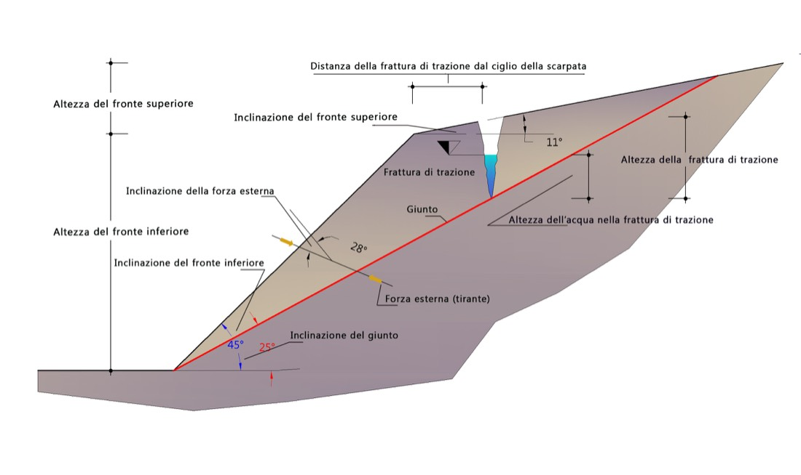

# Planar sliding

Stability analysis for **sliding along a single plane**. It applies when a discontinuity has a **dip direction close** (± 20°) to that of the slope face and a **dip lower** than that of the face (the *daylighting* condition): the overlying wedge can slide along the joint. The analysis is carried out using **limit equilibrium**.

{ loading=lazy }

*Figure 1 — Limit equilibrium conditions of a slope affected by a joint, with a planar upper face.*

Two failure geometries are assumed: **absence** or **presence** of an open tension crack in the upper part of the slope.

## Notation

| Symbol | Quantity |
|---|---|
| $A$ | length of the sliding plane |
| $W$ | weight of the detaching wedge |
| $\psi$ | inclination of the joint (sliding plane) |
| $H_f$ | height of the face |
| $\alpha$ | inclination of the face |
| $\gamma$ | unit weight of the rock |
| $\gamma_w$ | unit weight of water |
| $H_w$ | height of water on the plane |
| $a_g$ | maximum horizontal acceleration |
| $F_H$ | seismic inertia force |
| $U$ | water thrust on the plane |
| $V$ | water thrust in the tension crack |
| $Q$ | external forces, inclined by $\theta$ |
| $z$ | height of the tension crack |
| $b$ | distance of the tension crack from the crest |
| $z_w$ | height of water in the tension crack |

## Base case — absence of a tension crack

In the simplest case (no tension crack, no external forces), equilibrium is expressed by the factor of safety:

$$ FS = \frac{c \cdot A + W\cos\psi \cdot \tan\varphi}{W\sin\psi} $$

where $c$ and $\varphi$ are the cohesion and friction angle of the joint.

The **length of the plane** and the **weight of the wedge** are obtained from the geometry:

$$ A = \frac{H_f}{\sin\psi} \qquad W = \frac{1}{2}\,\gamma\,H_f^{\,2}\left(\cot\psi - \cot\alpha\right) $$

## General case — water, seismic action and external forces

In the presence of water in the joints and external actions, the quantities involved are:

**Seismic inertia force** (with $S = 1$, since these are rock formations):

$$ F_H = S \cdot a_g \cdot W $$

**Water thrust on the plane** (drained slope, triangular distribution):

$$ U = \frac{1}{2}\,\gamma_w\,H_w\,A $$

The factor of safety becomes:

$$ FS = \frac{c\,A + \left(W\cos\psi - U - F_H\sin\psi\right)\tan\varphi}{W\sin\psi + F_H\cos\psi} $$

The **external forces** $Q$ inclined by $\theta$ (surcharges, interventions) enter the equilibrium through their components relative to the plane: the **normal** component increases (or reduces) the normal stress and hence the resisting frictional contribution, while the **tangential** component adds to the driving or resisting forces depending on its direction.

## Tension crack

When a tension crack of height $z$ is present at a distance $b$ from the crest, with water of height $z_w$, the **water thrust in the crack** is added:

$$ V = \frac{1}{2}\,\gamma_w\,z_w^{\,2} $$

and the factor of safety includes the $V$ terms:

$$ FS = \frac{c\,A + \left(W\cos\psi - U - V\sin\psi - F_H\sin\psi\right)\tan\varphi}{W\sin\psi + V\cos\psi + F_H\cos\psi} $$

with the length of the plane reduced by the presence of the crack.

## Impeded drainage (retention basin)

The expression for water thrust shown above applies to a **drained** slope in the case of intense rainfall. When drainage at the toe is impeded — for example in a **retention basin** — the pressure on the joint is greater (a distribution close to the full hydrostatic case):

$$ U = \gamma_w\,H_w\,A $$

{ loading=lazy }

*Figure 2 — Retention basin, significant quantities.*

## Inclined upper face

When the sliding plane affects an upper face that is slightly inclined by an angle $\beta$, the design height becomes the overall height $H_p$ (lower face + upper face) and the expressions for $A$ and $W$ adapt to the new geometry; in the presence of a tension crack, the same considerations as in the previous case apply. Here too, if drainage at the toe is impeded, the water thrust on the joint takes the impeded-drainage form.

{ loading=lazy }

*Figure 3 — Limit equilibrium conditions of a slope affected by a joint, with an inclined upper face.*

!!! note "Two-joint kinematics"
    For the sliding of a wedge formed by **two** discontinuities, see [Sliding 3D](sliding-3d.md). For the **design of interventions** (rock bolts, anchors, meshes) on planar failure with code-based verification according to NTC 2018 / EC7, please refer to [RockPlane NX](https://help.nx.geostru.ai/rockplane/en/).

---

*Found an error on this page? [Let us know](mailto:info@geostru.ai?subject=Help%20Rock%20Mechanics%20NX).*
