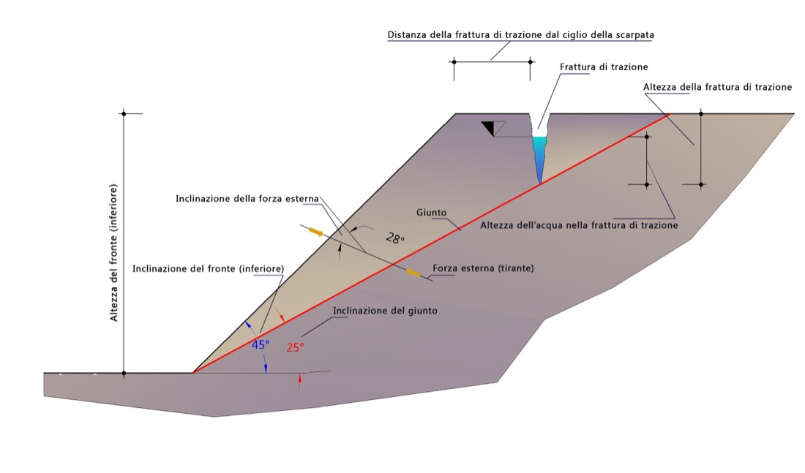
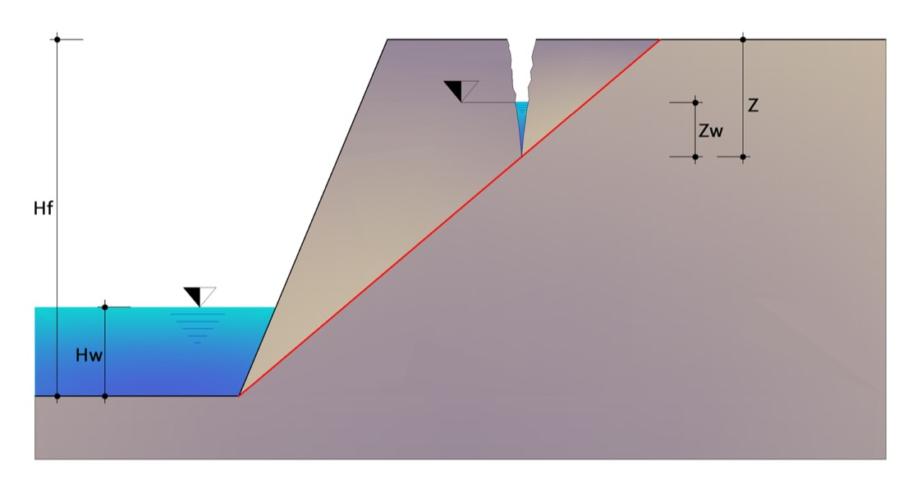

# Scivolamento planare

Verifica di stabilità per **scivolamento lungo un singolo piano**. Si applica quando una discontinuità presenta un'**immersione prossima** (± 20°) a quella del fronte e un'**inclinazione inferiore** a quella del fronte (condizione di *daylighting*): il cuneo sovrastante può scorrere lungo il giunto. L'analisi è condotta all'**equilibrio limite**.

{ loading=lazy }

*Figura 1 — Condizioni di equilibrio limite di una scarpata interessata da un giunto, con fronte superiore piano.*

Si ipotizzano due geometrie di rottura: **assenza** o **presenza** di una frattura di trazione aperta nella parte alta della scarpata.

## Simbologia

| Simbolo | Grandezza |
|---|---|
| $A$ | lunghezza del piano di scivolamento |
| $W$ | peso del cuneo di distacco |
| $\psi$ | inclinazione del giunto (piano di scivolamento) |
| $H_f$ | altezza del fronte |
| $\alpha$ | inclinazione del fronte |
| $\gamma$ | peso di volume della roccia |
| $\gamma_w$ | peso di volume dell'acqua |
| $H_w$ | altezza dell'acqua sul piano |
| $a_g$ | accelerazione orizzontale massima |
| $F_H$ | forza d'inerzia sismica |
| $U$ | spinta idraulica sul piano |
| $V$ | spinta idraulica nella frattura di trazione |
| $Q$ | forze esterne, inclinate di $\theta$ |
| $z$ | altezza della frattura di trazione |
| $b$ | distanza della frattura di trazione dal ciglio |
| $z_w$ | altezza dell'acqua nella frattura di trazione |

## Caso base — assenza di frattura di trazione

Nell'ipotesi più semplice (nessuna frattura di trazione, nessuna forza esterna), l'equilibrio è espresso dal coefficiente di sicurezza:

$$ FS = \frac{c \cdot A + W\cos\psi \cdot \tan\varphi}{W\sin\psi} $$

dove $c$ e $\varphi$ sono coesione e angolo d'attrito del giunto.

La **lunghezza del piano** e il **peso del cuneo** si ricavano dalla geometria:

$$ A = \frac{H_f}{\sin\psi} \qquad W = \frac{1}{2}\,\gamma\,H_f^{\,2}\left(\cot\psi - \cot\alpha\right) $$

## Caso generale — acqua, sisma e forze esterne

In presenza di acqua nei giunti e di azioni esterne, le grandezze in gioco sono:

**Forza d'inerzia sismica** (con $S = 1$ trattandosi di formazioni rocciose):

$$ F_H = S \cdot a_g \cdot W $$

**Spinta idraulica sul piano** (scarpata drenata, distribuzione triangolare):

$$ U = \frac{1}{2}\,\gamma_w\,H_w\,A $$

Il coefficiente di sicurezza diventa:

$$ FS = \frac{c\,A + \left(W\cos\psi - U - F_H\sin\psi\right)\tan\varphi}{W\sin\psi + F_H\cos\psi} $$

Le **forze esterne** $Q$ inclinate di $\theta$ (sovraccarichi, interventi) entrano nell'equilibrio con le loro componenti rispetto al piano: la componente **normale** incrementa (o riduce) lo sforzo normale e quindi il contributo attritivo resistente, la componente **tangenziale** si somma alle forze motrici o resistenti secondo il verso.

## Frattura di trazione

Quando è presente una frattura di trazione di altezza $z$ a distanza $b$ dal ciglio, con acqua di altezza $z_w$, si aggiunge la **spinta idraulica nella frattura**:

$$ V = \frac{1}{2}\,\gamma_w\,z_w^{\,2} $$

e il coefficiente di sicurezza include i termini di $V$:

$$ FS = \frac{c\,A + \left(W\cos\psi - U - V\sin\psi - F_H\sin\psi\right)\tan\varphi}{W\sin\psi + V\cos\psi + F_H\cos\psi} $$

con la lunghezza del piano ridotta dalla presenza della frattura.

## Drenaggio impedito (bacino di ritenuta)

L'espressione della spinta idraulica vista sopra vale per scarpata **drenata** in caso di precipitazioni intense. Quando il drenaggio al piede è impedito — per esempio in un **bacino di ritenuta** — la pressione sul giunto è maggiore (distribuzione prossima all'idrostatica piena):

$$ U = \gamma_w\,H_w\,A $$

{ loading=lazy }

*Figura 2 — Bacino di ritenuta, grandezze significative.*

## Fronte superiore inclinato

Quando il piano di scivolamento interessa un fronte superiore leggermente inclinato di un angolo $\beta$, l'altezza di calcolo diventa quella complessiva $H_p$ (fronte inferiore + fronte superiore) e le espressioni di $A$ e $W$ si adeguano alla nuova geometria; in presenza di frattura di trazione valgono le stesse considerazioni del caso precedente. Anche qui, se il drenaggio al piede è impedito, la spinta idraulica sul giunto assume la forma a drenaggio impedito.

{ loading=lazy }

*Figura 3 — Condizioni di equilibrio limite di una scarpata interessata da un giunto, con fronte superiore inclinato.*

!!! note "Cinematismi a due giunti"
    Per lo scivolamento di un cuneo formato da **due** discontinuità vedi [Sliding 3D](sliding-3d.md). Per il **progetto degli interventi** (chiodi, tiranti, reti) su rottura planare con verifica normativa NTC 2018 / EC7 si rimanda a [RockPlane NX](https://help.nx.geostru.ai/rockplane/it/).

---

*Hai trovato un errore in questa pagina? [Segnalacelo](mailto:info@geostru.ai?subject=Help%20Rock%20Mechanics%20NX).*
