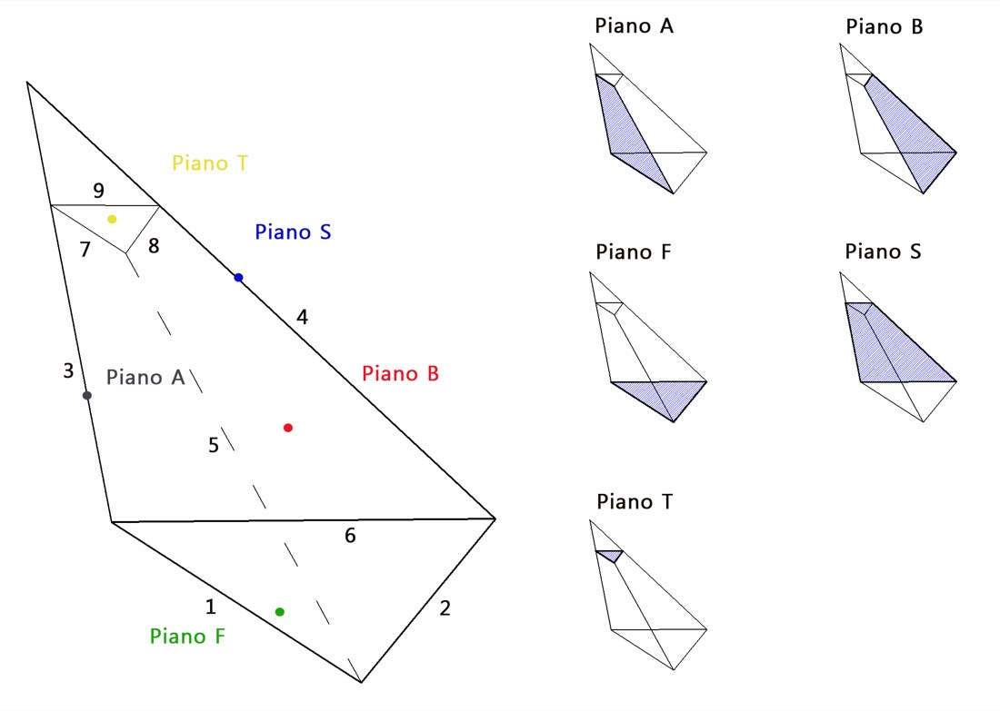

# Sliding 3D — scivolamento di un cuneo

Uno dei casi più frequenti nella pratica. Quando l'ammasso presenta **più sistemi di discontinuità** diversamente orientati, due piani possono intersecarsi formando un **cuneo di roccia di forma tetraedrica** che dà luogo a un meccanismo **tridimensionale** di rottura. È la situazione tipica all'origine di molti dissesti di scarpate e fronti rocciosi.

Il moto associato allo scivolamento può avvenire:

- **lungo la linea di intersezione** dei due piani — a condizione che questa retta abbia inclinazione inferiore a quella del fronte e immersione uguale a quella del fronte;
- **su un solo piano**, a seconda della direzione del moto e della giacitura delle discontinuità.

## Schema di calcolo

{ loading=lazy }

*Figura — Schema del cuneo tridimensionale e dei piani che lo definiscono.*

## Il calcolo del coefficiente di sicurezza

Il calcolo nelle condizioni di tridimensionalità tipiche del modello comporta la determinazione, nell'ordine, di:

1. **Versori della giacitura** di ogni piano: normale al piano A, al piano B, all'eventuale piano superiore S, al piano del fronte F e all'eventuale piano della frattura di trazione T. In presenza di **forze esterne** (pseudo-statiche, di stabilizzazione) si definiscono anche i versori delle loro direzioni di azione.
2. **Vettori delle linee di intersezione** fra i piani, la cui giacitura è data dal prodotto vettoriale dei rispettivi versori normali.
3. **Dimensioni lineari e volume** di roccia del cuneo.
4. **Aree dei piani A, B e T**, per computare i contributi di resistenza attritiva ed eventualmente coesiva.
5. **Coefficienti delle relazioni effettive normali**.
6. **Peso del cuneo** mobilitato.
7. **Spinte idrauliche** sull'eventuale frattura di trazione, sui piani A e B ed eventualmente sul fronte.
8. **Controlli cinematici** per definire la possibilità dello scivolamento tridimensionale e il tipo di scivolamento (lungo l'intersezione o su un singolo piano).
9. **Forze aggiuntive** resistenti (stabilizzazione) e destabilizzanti (condizioni sismiche), e infine il **coefficiente di sicurezza**.

!!! note "Quando usare quale strumento"
    Rock Mechanics NX riconosce il cinematismo a cuneo e ne calcola la sicurezza a partire dal rilievo. Per il **dimensionamento degli interventi** (chiodi, tiranti, reti paramassi) e per analisi parametriche dedicate si rimanda a [RockPlane NX](https://help.nx.geostru.ai/rockplane/it/) e alle applicazioni [Geoapp](geoapp.md) (Cunei 3D).

---

*Hai trovato un errore in questa pagina? [Segnalacelo](mailto:info@geostru.ai?subject=Help%20Rock%20Mechanics%20NX).*
