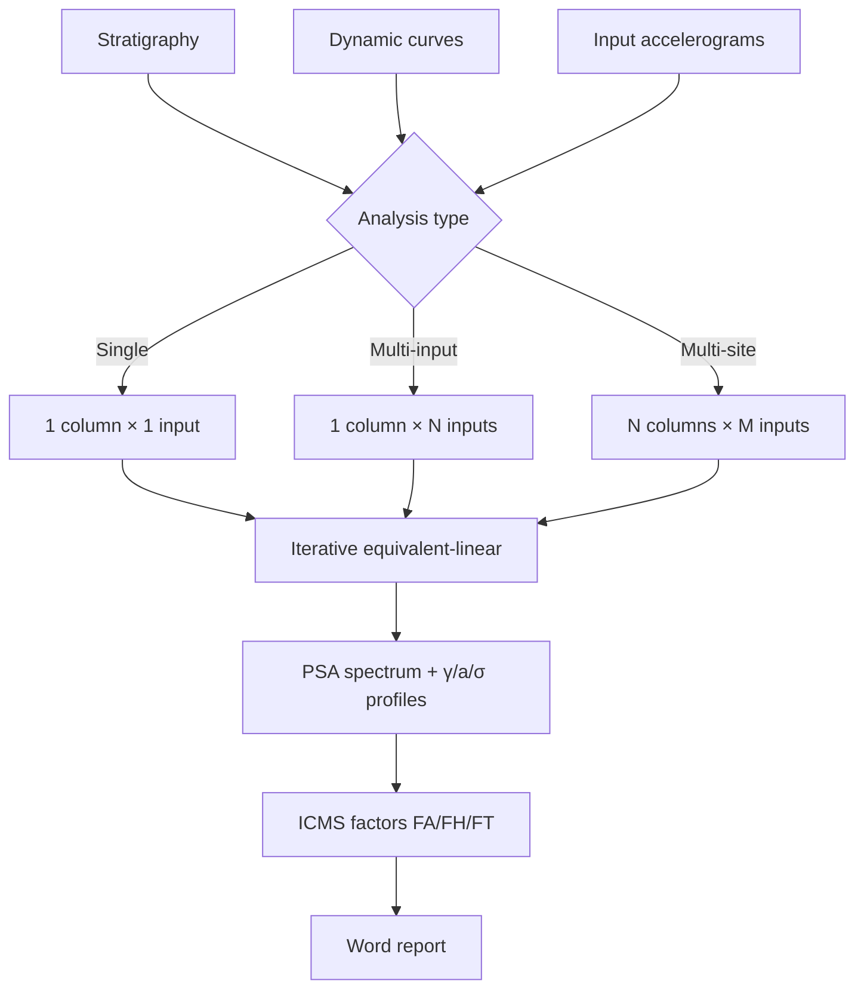

# Complete workflow

Detailed sequence of a real RSL analysis, from input to report.

## Overall scheme

```
INPUT                          CALCULATION                OUTPUT
─────                          ───────────                ──────
1. Stratigraphy                5. Discretisation          7. Surface PSA spectrum
2. Dynamic curves                  (sub-layers)            8. Input/output Fourier
   G/Gmax-γ + ξ-γ              6. Equivalent linear        9. γ/a/σ vs z profiles
3. Bedrock                          iterative →           10. FA/FH/FT factors
   accelerogram                     ↓                      11. Word report
4. Analysis type
   (single/multi-site)
```

## 1. Stratigraphy

Main page → **Stratigraphy** tab. For each layer define:

| Field | Unit | Meaning |
|---|---|---|
| **Thickness** | m | layer thickness |
| **Vs** | m/s | shear-wave velocity (at small strain) |
| **ρ** (density) | kN/m³ or kg/m³ | density (unit weight / g) |
| **G_max** | MPa | computed as `ρ · Vs²` (default) or entered |
| **ξ_min** | % | minimum damping (small strain, typically 0.5-3%) |
| **G/Gmax-γ curve** | — | chosen from the library or custom |
| **ξ-γ curve** | — | chosen from the library or custom |

The bottom layer is the **bedrock**, must have Vs ≥ 800 m/s and a depth
such that seismic waves are effectively in 1D propagation.

## 2. Dynamic curves

RSL III ships with a **library** of standard literature curves:

- **Vucetic-Dobry (1991)** — clays, function of PI
- **Seed-Idriss (1970)** — sands, mid range
- **Darendeli (2001)** — sands and clays, OCR- and σ'-dependent
- **EPRI (1993)** — general
- **Custom curves** — uploaded by the user as a γ → G/G_max and γ → ξ table

Each layer can be assigned a different pair of curves.

## 3. Input accelerogram

**Input** tab → load/paste the accelerogram at the **bedrock** (below
the column). Supported formats:

- **PEER** (text, standard header)
- **ITACA** (Italian INGV format, text)
- **Generic** (CSV with header `time, accel`)

The app auto-detects the Δt interval and total duration. Typical range:
20-40 seconds at Δt = 0.005-0.01 s.

!!! tip "Bedrock vs outcrop"
    Check whether your accelerogram is recorded on **outcropping
    bedrock** (outcrop) or inside the column (within). If it is outcrop
    and you enter it as within, you overestimate. RSL III treats the
    input as outcrop by default and applies the 1/2 correction in
    spectral deconvolution — see the [FAQ](faq.md) if in doubt.

## 4. Analysis type

- **Single-site**: 1 column × 1 accelerogram → deterministic spectrum
- **Multi-input**: 1 column × N accelerograms (e.g. 7 recordings) →
  **mean** spectrum + envelope (recommended by NTC 2018 for advanced
  analyses)
- **Multi-column**: comparison of different stratigraphies — useful for
  area-wide microzonation studies

## 5. Run the calculation

Press **Run**. RSL III:

1. **Discretises** the column into sub-layers: max ~25 sub-layers to
   avoid aliasing at high frequencies (rule: Δh ≤ Vs / (4·f_max), with
   f_max typically 25 Hz)
2. Computes the complex **transfer function** H(ω) between bedrock and
   surface (reflection/transmission coefficients method for plane shear
   waves in layered columns, frequency domain)
3. Computes the output **Fourier spectrum**: F_out(ω) = H(ω) · F_in(ω)
4. Inverse-transforms to get the surface accelerogram in time
5. Estimates γ_max in each layer (γ_eff = 0.65 · γ_max per Idriss)
6. Updates G_secant and ξ by reading the degradation curves at γ_eff
7. **Iterates** until Δγ_eff < tolerance (default 0.5%, max 30 iterations)

See [metodo.md](metodo.md) for the mathematical details.

## 6. Inspect the results

**Results** tab → 4 panes:

### Response spectrum

PSA (Pseudo Spectral Acceleration) or SA versus period T, 5% damping.
Comparison with the reference NTC 2018 spectrum for the site (based on
ground category, a_g, T_R). Where RSL > NTC = local amplification not
captured by the standard NTC spectrum.

### Fourier spectra

Input vs output, log-log scale. Shows the site amplification frequencies
(f₀ = Vs / 4H for the first mode, higher modes at multiple frequencies).

### Profiles along z

- **γ_max(z)** in % — layers with γ > 0.1% are in non-linear regime
- **a_max(z)** — acceleration amplification from bedrock to surface
- **σ_max(z)** — maximum shear (kPa)

### ICMS amplification factors

Summary table with FA, FH, FT (details in [icms.md](icms.md)).

## 7. Export

**Report** toolbar. Generates a `.docx` structured for:

- Level 3 seismic microzonation
- Geological reports for structural design
- Site seismic hazard studies

---

## Summary diagram



---

*Page useful? [Contact us](mailto:info@geostru.ai?subject=Help%20RSL%20III%20-%20Workflow).*
