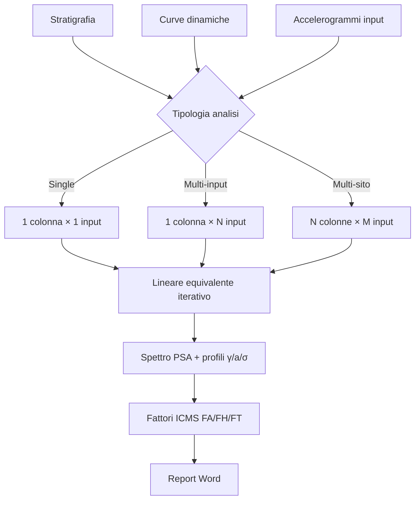

# Workflow completo

Sequenza dettagliata di un'analisi RSL reale, dall'input al report.

## Schema generale

```
INPUT                          CALCOLO                    OUTPUT
─────                          ───────                    ──────
1. Stratigrafia                5. Discretizzazione        7. Spettro PSA superficie
2. Curve dinamiche                 (sotto-strati)          8. Fourier in/out
   G/Gmax-γ + ξ-γ              6. Lineare equivalente      9. Profili γ/a/σ vs z
3. Accelerogramma                  iterativo →            10. Fattori FA/FH/FT
   alla bedrock                    ↓                       11. Report Word
4. Tipologia analisi
   (single/multi-site)
```

## 1. Stratigrafia

Pagina principale → tab **Stratigrafia**. Per ogni strato definisci:

| Campo | Unità | Significato |
|---|---|---|
| **Spessore** | m | spessore dello strato |
| **Vs** | m/s | velocità onde di taglio (in piccoli deformazioni) |
| **ρ** (densità) | kN/m³ o kg/m³ | densità (peso unità di volume / g) |
| **G_max** | MPa | calcolato da `ρ · Vs²` (default) o inserito |
| **ξ_min** | % | smorzamento minimo (in piccolo, tipicamente 0.5-3%) |
| **Curva G/Gmax-γ** | — | scelta dalla libreria o custom |
| **Curva ξ-γ** | — | scelta dalla libreria o custom |

L'ultimo strato è il **bedrock**, deve avere Vs ≥ 800 m/s e profondità tale
che le onde sismiche entrino effettivamente in regime di propagazione 1D.

## 2. Curve dinamiche

RSL III viene fornito con la **libreria** delle curve standard di
letteratura:

- **Vucetic-Dobry (1991)** — argille, in funzione di IP
- **Seed-Idriss (1970)** — sabbie, range medio
- **Darendeli (2001)** — sabbie e argille, OCR e σ' dipendente
- **EPRI (1993)** — generale
- **Curve custom** — caricate dall'utente come tabella γ → G/G_max e γ → ξ

Per ogni strato puoi assegnare una coppia di curve diversa.

## 3. Accelerogramma di input

Tab **Input** → carica/incolla l'accelerogramma alla **bedrock** (sotto la
colonna). Formati supportati:

- **PEER** (testo, header standard)
- **ITACA** (Istituto Nazionale di Geofisica e Vulcanologia, formato testo)
- **Generico** (CSV con header `time, accel`)

L'app riconosce automaticamente intervallo Δt e durata totale. Range
tipico: 20-40 secondi a Δt = 0.005-0.01 s.

!!! tip "Bedrock vs outcrop"
    Verifica se il tuo accelerogramma è registrato su **bedrock affiorante**
    (outcrop) o all'interno della colonna (within). Se è outcrop e lo
    inserisci come within, sovrastimi. RSL III tratta l'input come outcrop di
    default e applica la correzione 1/2 nel deconvoluzione spectrale —
    consulta [FAQ](faq.md) se hai dubbi.

## 4. Tipologia di analisi

- **Single-site**: 1 colonna × 1 accelerogramma → spettro deterministico
- **Multi-site (input multipli)**: 1 colonna × N accelerogrammi (es. 7
  registrazioni accelerometriche) → spettro **medio** + envelope (raccomandato
  da NTC 2018 per analisi avanzate)
- **Multi-colonna**: confronto di stratigrafie diverse — utile per studi
  di microzonazione su area

## 5. Esegui calcolo

Premi **Esegui**. RSL III:

1. **Discretizza** la colonna in sotto-strati: max ~25 sub-strati per evitare
   aliasing alle alte frequenze (regola: Δh ≤ Vs / (4·f_max), tipicamente
   f_max = 25 Hz)
2. Calcola la **funzione di trasferimento** complessa H(ω) tra bedrock e
   superficie (metodo dei coefficienti di riflessione e trasmissione delle
   onde di taglio piane in colonne stratificate, dominio frequenziale)
3. Calcola lo **spettro di Fourier** dell'output: F_out(ω) = H(ω) · F_in(ω)
4. Antitrasforma per ottenere accelerogramma di superficie nel tempo
5. Stima γ_max in ogni strato (γ_eff = 0.65 · γ_max per Idriss)
6. Aggiorna G_secant e ξ leggendo le curve di degradazione al γ_eff
7. **Itera** finché Δγ_eff < tolleranza (default 0.5%, max 30 iterazioni)

Vedi [metodo.md](metodo.md) per i dettagli matematici.

## 6. Esamina i risultati

Tab **Risultati** → 4 schede:

### Spettro di risposta

PSA (Pseudo Spectral Acceleration) o SA in funzione del periodo T, smorzamento
5%. Confronto con spettro NTC 2018 di riferimento per il sito (in base a
categoria suolo, a_g, T_R). Le aree dove RSL > NTC = amplificazione locale
non catturata dallo spettro NTC standard.

### Spettri di Fourier

Input vs output, scala log-log. Mostra le frequenze di amplificazione
del sito (f₀ = Vs / 4H per il primo modo, modi superiori a frequenze
multiple).

### Profili lungo z

- **γ_max(z)** in % — strati con γ > 0.1% sono in regime non lineare
- **a_max(z)** — amplificazione dell'accelerazione dalla bedrock alla superficie
- **σ_max(z)** — taglio massimo (kPa)

### Fattori di amplificazione ICMS

Tabella riassuntiva con FA, FH, FT (dettaglio in [icms.md](icms.md)).

## 7. Esporta

Toolbar **Report**. Genera un `.docx` strutturato per:

- Microzonazione sismica di Livello 3
- Relazioni geologiche per progettazione strutturale
- Studi di pericolosità sismica di sito

---

## Schema riassuntivo



---

*Pagina utile? [Scrivici](mailto:info@geostru.ai?subject=Help%20RSL%20III%20-%20Workflow).*
