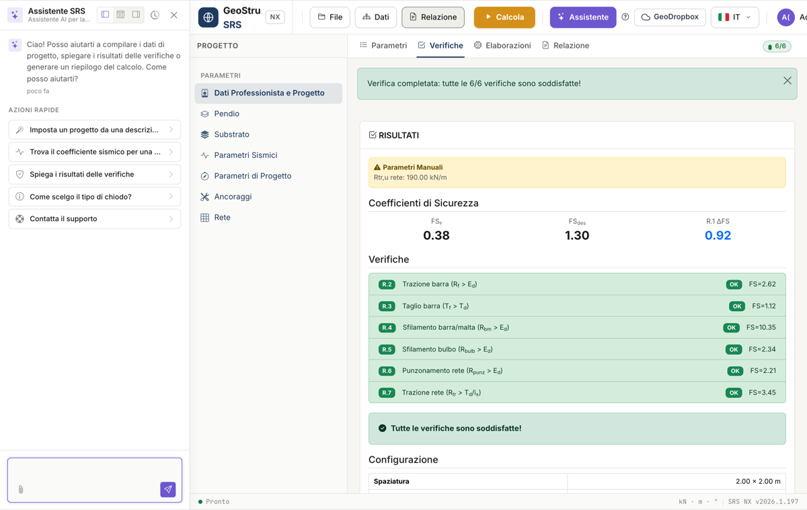

# AI assistant

SRS NX includes a context-aware **AI assistant**: it always knows the open
project (substrate, input parameters and design-check results, if any) and
helps you in three ways. Open it from the **Assistant** button at the top.

## 1. Technical chat

Ask questions about the open project: the assistant explains why a check is
not satisfied, what a parameter represents, how to interpret FS₀ and
FS_des. It answers by citing the project's actual values, never invented
numbers. From the assistant's menu you can also **contact support** and open
a ticket.

## 2. Set up a project from a description

Instead of filling in field by field, write in plain language the problem
you want to solve — slope geometry, soil or rock, nail type, mortar, facing
mesh — and ask the assistant to set up the project. The assistant fills the
entire form (title, design code, substrate, slope parameters, anchors,
mortar, mesh) in a single action.

**Example**: *"Sandy soil slope at 35°, 1.5 m overburden, φ' = 30°, no water
table. Use GEWI Ø25 nails, R_ck 30 mortar, 2×2 m spacing, and set FS_des to
1.3."*

!!! warning "Always review the values it sets"
    The assistant fills in the project but does not verify it: check the
    values before pressing **Calculate**. The operation overwrites the
    fields of the open project.

## 3. Seismic coefficient from a location

Ask the assistant for the seismic coefficient of a site — for example
*"what's the K_h for Bologna?"* — and it will use the lat/lon from context
or ask you for them. The assistant connects to the **GeoStru Parametri
Sismici** service and retrieves the ground acceleration **a_g**, the
amplification factor **F₀** and the period **T_C\*** for the location, then
proposes a horizontal seismic coefficient **K_h** ready to insert in the
[Seismic action](sismica.md) section.

!!! warning "Check local amplification"
    The proposed K_h assumes unit stratigraphic and topographic
    amplification. If the site's subsoil category or morphology implies
    significant amplification, increase the value before using it in the
    design.

## Quick actions

The assistant panel offers a few quick actions to get started without
typing:

- **Set up a project from a description**
- **Find the seismic coefficient for a location**
- **Explain the design-check results**
- **How do I choose the nail type?**
- **Contact support**

!!! note "The assistant consumes NX credits"
    Every message sent to the assistant consumes NX credits, just like the
    calculation and the report export. Responsibility for the project
    remains with the designer: the assistant is a support tool, not a
    substitute for technical verification.

---

*Found an error on this page? [Let us know](mailto:info@geostru.ai?subject=Help%20SRS%20NX) or open a [Pull Request](https://github.com/EngSoft-Geostru/geostru-help-nx/edit/main/srs/docs/en/assistente-ai.md).*
