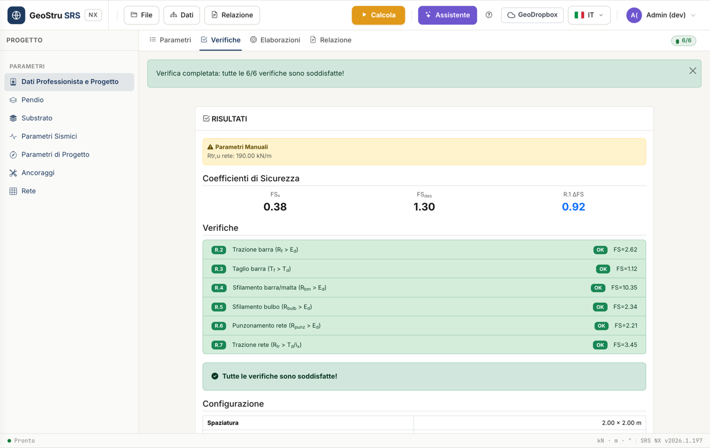

# Design checks

After **Calculate**, the **Design checks** tab summarises the safety factors
and the outcome of the six anchor resistance checks. This page explains
what each one compares and how to read them.

## Safety factors

- **FS₀** — the slope's safety factor **before** the intervention
  (computed in step 1 of the Design parameters card).
- **FS_des** — the **design** safety factor, the target you chose.
- **R.1 ΔFS** — the increase achieved: `ΔFS = FS_des − FS₀`.

From FS_des, SRS derives the **tension force A** each anchor must provide to
bring the slope from FS₀ to FS_des, accounting for the anchor's
inclination β relative to the slope. This force, multiplied by the
design-code coefficient γ_Q1, is the design **E_d** (tension) and **T_d**
(shear) demand used in every check below.

## The six checks (R.2–R.7)

| Code | Check | Comparison |
|---|---|---|
| **R.2** | Bar tension | R_f > E_d |
| **R.3** | Bar shear | T_f > T_d |
| **R.4** | Bar/mortar slip | R_bm > E_d |
| **R.5** | Bulb slip | R_bulb > E_d |
| **R.6** | Mesh punching | R_punz,des > E_d |
| **R.7** | Mesh tension | R_tr,des > T_d / i_x |

Each check is **satisfied** when the resistance exceeds the demand, and
shows its own safety factor `FS = resistance / demand`.

### R.2 — Bar tension

Compares the bar's maximum tension resistance **R_f** (from the diameter
φ_b, the yield strength f_yk and the coefficient γ_s) with the design
tension demand **E_d**. If not satisfied: increase the bar diameter or use
steel with a higher f_yk.

### R.3 — Bar shear

Compares the bar's shear resistance **T_f** (derived from R_f with the von
Mises criterion, `T_f = R_f / √3`) with the design shear demand **T_d**. If
not satisfied: increase the bar diameter, the grid spacing (i_x, i_y), or
use steel with a higher f_yk.

### R.4 — Bar/mortar slip

Compares the maximum bar-mortar bond **R_bm** (from the mortar's design
bond strength f_bd and the length L_a) with **E_d**. If not satisfied:
increase the anchor length, the drilling diameter, or the mortar strength
(R_ck).

### R.5 — Bulb slip

Compares the bulb pull-out resistance from the substrate **R_bulb** (from
the bulb's collaborating length L_b, the substrate-mortar bond stress
τ_sub, the drilling diameter, and the reduction coefficients ξ_a4 and
γ_Rap) with **E_d**. If not satisfied: increase the anchor length, the
drilling diameter, or the number of geotechnical investigation profiles
(reduces ξ_a4).

### R.6 — Mesh punching

Compares the mesh's design punching resistance **R_punz,des** with **E_d**.
If not satisfied: choose a mesh with a higher punching resistance.

### R.7 — Mesh tension

Compares the mesh's design tension resistance **R_tr,des** with the shear
demand distributed over the horizontal spacing, **T_d / i_x**. If not
satisfied: choose a mesh with a higher tension resistance or reduce the
i_x spacing.

!!! tip "A hint for every failed check"
    When a check fails, the card automatically shows a suggestion of which
    parameter to change — the same ones listed above.

## Anchors per 100 m²

- **R.8 Count** — how many anchors are needed per 100 m² of mesh:
  `N_tot = round(100 / (i_x · i_y))`.
- **R.9 Total drilling length** — the corresponding drilling metres:
  `L_tot = N_tot · L_a`.

These are the two figures to report in a preliminary bill of quantities for
the intervention.

## Estimated cost

If you filled in the **Cost parameters** (drilling €/m, steel €/kg, mortar
€/m³, mesh €/m²) in the Professional Data and Project section, the Design
checks tab also shows an estimate of the **total cost per 100 m²** of
mesh — the sum of drilling cost, bar steel cost, grouting mortar cost and
mesh cost.

---

*Found an error on this page? [Let us know](mailto:info@geostru.ai?subject=Help%20SRS%20NX) or open a [Pull Request](https://github.com/EngSoft-Geostru/geostru-help-nx/edit/main/srs/docs/en/verifiche.md).*
