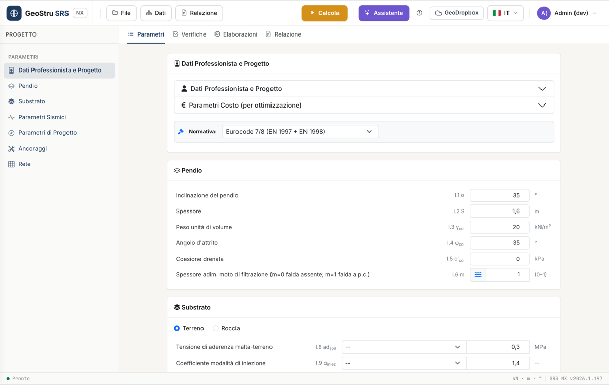

# Interfaccia e flusso di lavoro

SRS NX è organizzato in tre zone: la **toolbar** in alto, la **sidebar
PROGETTO** a sinistra e il **pannello centrale** a tab. Questa pagina descrive
ognuna e la sequenza completa di un progetto.

## La toolbar

- **File** — Nuovo, Salva, Apri (progetto `.srs`).
- **Dati** — collegamenti rapidi alle sezioni della sidebar (Dati
  Professionista, Pendio, Substrato, Parametri Sismici, Parametri di
  Progetto, Ancoraggi, Rete).
- **Relazione** — esporta la relazione in Word (DOCX), PDF o DOC. Attivo solo
  dopo un calcolo con risultati.
- **Calcola** — pulsante evidenziato, avvia il calcolo completo (equivalente
  al passo 3 «Avvia» della card Parametri di Progetto).
- **Assistente** — apre la chat AI.
- **?** — apre il modale di aiuto, con il collegamento a questo manuale.
- **GeoDropbox** — salva e recupera i progetti dallo spazio cloud della suite.
- Selettore lingua e menu utente con il saldo crediti.

## La sidebar PROGETTO

Elenca le sette sezioni di input, nell'ordine in cui compaiono nella tab
**Parametri**: **Dati Professionista e Progetto**, **Pendio**, **Substrato**,
**Parametri Sismici**, **Parametri di Progetto**, **Ancoraggi**, **Rete**. Un
clic scorre direttamente alla sezione.

## Le quattro tab

### Parametri

Tutti i dati di input, organizzati nelle sette sezioni descritte sopra.
**Dati Professionista e Progetto** è una card comprimibile con i tuoi dati,
il titolo del progetto, le coordinate del sito e un'immagine descrittiva
facoltativa; contiene anche l'accordion **Parametri Costo**, usato per stimare
il costo dell'intervento. Qui scegli anche la **normativa** di riferimento
(Eurocode 7/8, NTC 2018, oppure Utente per coefficienti parziali
personalizzati).

### Verifiche

Compare dopo un calcolo. Mostra FS₀, FS_des, l'incremento ΔFS, l'esito delle
sei verifiche R.2–R.7, un riepilogo di configurazione (spaziatura, lunghezza,
inclinazione, diametri) e il numero di ancoraggi/metri di perforazione ogni
100 m². Vedi [Verifiche](verifiche.md).

### Elaborazioni

I passaggi intermedi del calcolo (E.1–E.28): volumi, forze, resistenze di
barra e malta, geometria dell'ancoraggio, coefficienti riduttivi. Utile per
verificare un singolo passaggio o confrontare con un calcolo manuale.

### Relazione

Punto di partenza per generare il documento; l'esportazione vera e propria si
avvia dal menu **Relazione** della toolbar. Vedi
[Relazione ed esportazioni](relazione.md).

## Il flusso completo

1. **Pendio e substrato** — inserisci geometria e parametri geotecnici della
   coltre, scegli terreno o roccia. Vedi [Pendio e substrato](pendio.md).
2. **Azione sismica** (facoltativa) — imposta K_h se il sito è sismico. Vedi
   [Azione sismica](sismica.md).
3. **Calcola FS₀** — il coefficiente di sicurezza del pendio allo stato
   attuale, senza intervento.
4. **Imposta FS_des** — il coefficiente di sicurezza che l'intervento deve
   raggiungere.
5. **Chiodo e maglia** — scegli l'ancoraggio (catalogo o manuale) e
   l'interasse di posa. Vedi [Chiodi e ancoraggi](chiodi.md).
6. **Rete di facciata** — maglia, filo, resistenze. Vedi
   [Rete di facciata](rete.md).
7. **Calcola** — SRS determina la forza di trazione richiesta all'ancoraggio
   ed esegue le sei verifiche di resistenza.
8. **Leggi le Verifiche** — controlla che tutte e sei siano soddisfatte; se
   una fallisce, la card mostra un suggerimento su cosa modificare.
9. **Relazione** — esporta il documento di calcolo.

!!! note "FS₀ deve precedere FS_des"
    Il calcolo completo (**Avvia**/**Calcola**) richiede che FS₀ sia già stato
    determinato: se modifichi i parametri del pendio dopo averlo calcolato,
    ricalcolalo prima di proseguire.

---

*Hai trovato un errore in questa pagina? [Segnalacelo](mailto:info@geostru.ai?subject=Help%20SRS%20NX) o apri una [Pull Request](https://github.com/EngSoft-Geostru/geostru-help-nx/edit/main/srs/docs/it/workflow.md).*
