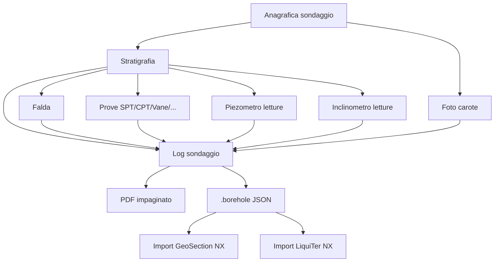

# Workflow completo

Sequenza di un sondaggio reale, dall'input al log + JSON di interscambio.

## 1. Anagrafica del sondaggio

Pannello **Anagrafica**:

- **Codice / nome** del sondaggio (es. `S1`, `BH-04`)
- **Coordinate** (lat/lon WGS84 o E/N metriche)
- **Quota piano campagna** (m s.l.m.)
- **Data inizio / fine** perforazione
- **Operatore / impresa** che ha eseguito il sondaggio
- **Tipologia** sondaggio: a carotaggio continuo, a distruzione di nucleo, …
- **Profondità totale** raggiunta

## 2. Stratigrafia

Tabella **Strati** con tante righe quanti sono i livelli stratigrafici.
Per ogni strato:

| Campo | Significato |
|---|---|
| **Top** (m) | tetto dello strato dal p.c. |
| **Base** (m) | letto |
| **Litologia** | descrizione UNI/ISO (es. *"sabbia limosa, ghiaia 5-10%"*) |
| **Simbolo** | simbolo grafico nel pattern library (granulometrico, fini, organico, …) |
| **Colore** | auto da litologia, override per casi particolari |
| **Note** | testo libero per descrizione granulometrica, plasticità, alterazione, … |

### Auto-completion litologia

Inizia a digitare nel campo Litologia → lista di suggerimenti standard
(da nomenclatura UNI 11531 / ISO 14689).

## 3. Falda

**Profondità falda al momento della perforazione** (m da p.c.). Se la
falda è stata letta a tempi diversi (per es. dopo settimana, mese), usa un
**piezometro** dedicato (vedi sotto).

## 4. Prove in sito

Stratigrapher gestisce **5 tipi** di prove:

### SPT (Standard Penetration Test)

Per profondità misurate, registra:

- **N1 / N2 / N3** colpi (15+15+15 cm) — N-SPT = N2+N3
- **Stato del campione** (intero, disturbato)
- Calcolo automatico **N1,60** (corretto per energia + pressione)
- **Grafico N-SPT vs z** sul log

### DPSH

- Colpi/10 cm continui per profondità
- Conversione automatica a equivalente N-SPT (se richiesto)
- Grafico continuo

### CPT / CPTU

Drag&drop di un file dello strumento CPT (formato proprietario:
Pagani, AP van den Berg, Geotech, …) → Stratigrapher parsa qc, fs, U
(se CPTU).

Output:

- **Grafici qc, fs, Rf vs z**
- **Classificazione SBT** (Soil Behaviour Type, Robertson 1990) sul log

### Vane Test

Resistenza al taglio non drenata Su per profondità → valore + grafico.

### Pressiometro

Moduli **E** e **pressione limite p_l** per profondità → grafici.

## 5. Piezometro (sondaggi specifici)

Per piezometri (sondaggi attrezzati con tubo Casagrande, tubo aperto, …):

- **Letture progressive** del livello freatico nel tempo
- Tabella `data, lettura (m)`
- **Grafico livello vs tempo** sul log finale

Utile per studiare oscillazioni stagionali della falda.

## 6. Inclinometro

Per sondaggi con inclinometro installato:

- **Letture iniziali** (x₀, y₀) per profondità
- **Letture successive** per ogni epoca
- **Grafico Δx, Δy vs z** che mostra eventuali movimenti del versante

## 7. Foto carote

Trascina nell'area dedicata le **foto delle cassette**. Per ogni foto:

- Stratigrapher associa automaticamente alla **profondità di carota**
  (se è nominata come "S1_2-4m.jpg")
- O associala a mano selezionando l'intervallo
- Le foto vengono incluse nel **PDF finale**

## 8. Esporta

### PDF impaginato

Format standard del log di sondaggio, con:

- Frontespizio con anagrafica + mappa
- Stratigrafia tabellare + colonna grafica
- Prove in sito + grafici
- Foto carote (impaginate per intervallo)
- Tabelle di letture piezometro/inclinometro se presenti

### `.borehole` (JSON GeoStru)

Formato di **interscambio** con altri prodotti NX:

- **GeoSection NX**: importa il `.borehole` come sondaggio per la sezione
- **Liquefaction NX**: importa stratigrafia + N-SPT per analisi liquefazione
- Altri software GeoStru desktop tramite adapter

## Schema riassuntivo

---

*Pagina utile? [Scrivici](mailto:info@geostru.ai?subject=Help%20Stratigrapher%20NX%20-%20Workflow).*
