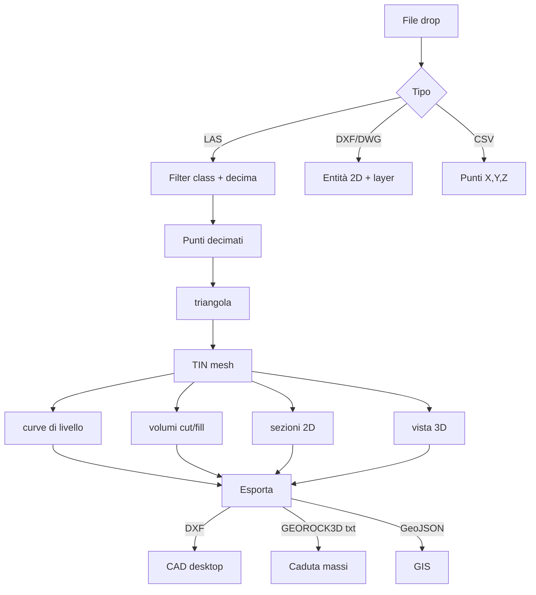

# Workflow completo

Sequenza dettagliata di un progetto reale, dal volo drone all'export
GEOROCK3D / DXF.

## Schema generale

```
ACQUISIZIONE                IMPORT                  ELABORAZIONE
────────────                ──────                  ────────────
1. Volo drone /             3. Drop file            5. Triangola TIN
   scanner / GPS               (.las/.dxf/.csv)     6. Curve livello
2. Processing               4. Filter + decima      7. Volumi
   (Pix4D/Metashape)                                8. Sezioni 2D
                                                    9. Vista 3D

EXPORT
──────
10. DXF AC1015           ← per CAD desktop (AutoCAD, BricsCAD)
11. GEOROCK3D .txt       ← per analisi caduta massi
12. GeoJSON              ← per GIS (QGIS, ArcGIS)
```

## 1. Acquisizione (fuori da Trispace)

Trispace non fa acquisizione — parte dai dati già processati. Le sorgenti
tipiche:

- **Drone fotogrammetrico** (DJI Phantom, Mavic) → Pix4D / Metashape /
  RealityCapture → `.las` / `.ply` / `.obj`
- **Scanner LiDAR terrestre** (Leica BLK360, Faro Focus) → `.las` / `.e57`
- **Scanner mobile** (iPhone Pro / iPad LiDAR + Polycam, Scaniverse) → `.ply`
- **Sondaggi GPS in cantiere** → CSV `X,Y,Z` o `lat,lon,Z`

Vedi [Importa](importa.md) per tutti i formati supportati.

## 2. Drop del file

Trascina il file nella **drop zone** centrale del canvas (oppure **File →
Apri**).

In funzione del tipo:

| Formato | Cosa fa |
|---|---|
| **.las** / **.laz** | Apre pannello import LAS con preview classification + decimazione |
| **.dxf** | Importa entità + layer originali (nessuna conversione di nomi) |
| **.dwg** | Conversione server-side via libreria → DXF → entità |
| **.csv** / **.txt** | Riconosce auto-formato `X Y Z` o `lat lon Z` (se georef attiva) |
| **.geojson** | Entità con coordinate metriche o WGS84 |
| **.png** / **.jpg** + worldfile | Raster georeferito (mappa di sfondo) |
| **.cadproj** | File nativo Trispace (project complete) |

## 3. Filtra e decima (solo per LAS)

Nel pannello import LAS:

### Filter classification

LAS contiene la **classification ASPRS** (1=unclassified, 2=ground, 3-5=vegetation,
6=building, 7=noise, 9=water, ...). Per la maggioranza dei workflow
geotecnici interessa **solo classe 2 (Ground)** = punti del terreno reale,
senza alberi né edifici.

### Voxel-grid downsampling

Una nuvola da 1M punti è troppo densa per la maggior parte dei calcoli.
Decima a:

- **5 000 punti** per visualizzazione veloce
- **15 000 punti** per TIN dettagliata + sezioni
- **50 000 punti** per analisi di precisione (volumi al cm)

Trispace usa **voxel grid** uniforme: divide lo spazio in celle di lato
fisso e tiene un punto per cella (più denso = più punti). Più rapido e
omogeneo del random downsampling.

## 4. Triangola TIN

Riga AI → `triangola`.

Server-side, **Delaunay 2.5D**:

1. Proietta i punti sul piano XY (ignora Z)
2. Triangola con algoritmo Delaunay (libreria `MIConvexHull` o equivalente)
3. Riassegna le quote Z originali a ogni vertice

Output: lista di triangoli `[a, b, c]` (indici nei punti) renderizzati sul
canvas.

[Approfondisci la mesh →](mesh-triangolazione.md)

## 5. Curve di livello

Riga AI → `curve` (oppure `curve 0.5` per passo manuale).

Trispace calcola le isoipse della TIN:

- Trova le **intersezioni** dei triangoli con piani orizzontali a passo Δz
- Concatena i segmenti in **polilinee chiuse** (curve di livello)
- Renderizza nel canvas con stile cartografico (curve principali ogni 5 ×
  passo, in colore più marcato)

## 6. Volumi

Riga AI → `volume 100` (calcola rispetto al piano Z = 100).

Per ogni triangolo della TIN:

- Calcola il **volume del prisma** sotto/sopra il piano di progetto
- Somma i contributi positivi (riporto, fill) e negativi (sterro, cut)

Output:

- **V_cut**, **V_fill**, **V_net = V_fill − V_cut** in m³
- **Cut/fill colormap** sulla mesh: rosso (sterro), blu (riporto)

## 7. Sezioni 2D

Tool **Sezione** (tasto S) → click 2 punti per definire la traccia di
sezione → si apre il **SectionPanel**.

Trispace:

1. Sample la mesh lungo la polilinea (passo automatico)
2. Disegna su un secondo canvas la **sezione 2D** con assi graduati
3. Permette di esportare la sezione come polilinea DXF

[Approfondisci sezioni e 3D →](sezioni-3d.md)

## 8. Vista 3D

Riga AI → `3d` (oppure click sul tab **3D** in alto).

Render Three.js della mesh con:

- **Shading** automatico (calcolo normali per face)
- **Curve di livello** sovrapposte come linee 3D
- **Cut/fill** colorato se calcolato
- Orbita libera, zoom, pan

## 9. Edita 2D (opzionale)

Toolbar **Disegno**: linea, polilinea, cerchio, arco, testo. Comandi singoli-tasto
AutoCAD-like:

| Tool | Tasto | Tool | Tasto |
|---|---|---|---|
| Linea | L | Sposta | M |
| Polilinea | P | Copia | C |
| Cerchio | G | Specchia | Y |
| Arco | A | Ruota | R |
| Testo | T | Trim | T |
| Sezione | S | Estendi | X |

Snap automatico: endpoint, midpoint, center, quadrant, perpendicular,
intersection. F8 per ortho. F1 per cheat-sheet.

[Approfondisci modellazione 2D →](modellazione-2d.md)

## 10. Esporta

Toolbar **File → Esporta**:

- **DXF** AutoCAD AC1015 — entità 2D + mesh + curve, layer originali preservati
- **GeoJSON** — entità con coordinate metriche per GIS
- **GEOROCK3D `.txt`** — punti decimati `id;X;Y;Z` direttamente caricabili
  in `Forms/ImportaPunti.cs` di GEOROCK3D
- **CSV punti** — `X,Y,Z` semplice

[Approfondisci esportazioni →](esportazioni.md)

---

## Schema riassuntivo



---

*Pagina utile? [Scrivici](mailto:info@geostru.ai?subject=Help%20Trispace%20NX%20-%20Workflow).*
